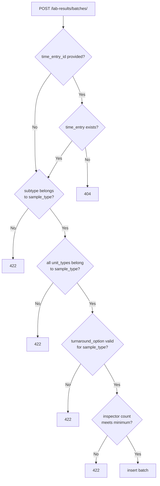

## Purpose

Owns lab result data: sample batch records and their associated units, inspectors, and turnaround options. Structured as two distinct layers — a config layer (admin-managed type definitions) and a data layer (field-collected batch records).

This module does **not** own time entries (though batches reference them), project state, or WA code logic. It owns the act of recording what samples were collected, by whom, in what quantity, and under which type classification.

---

## Non-obvious behavior

**Config layer vs. data layer — adding a new sample type requires no migration.**

| Layer | Tables | Who manages |
|-------|--------|-------------|
| Config | `sample_types`, `sample_subtypes`, `sample_unit_types`, `turnaround_options`, `sample_type_required_roles`, `sample_type_wa_codes` | Admin via `/lab-results/config/` endpoints |
| Data | `sample_batches`, `sample_batch_units`, `sample_batch_inspectors` | Field staff / managers via `/lab-results/batches/` endpoints |

A new sample type (e.g., a new asbestos protocol) is added as admin rows in the config layer — no schema migration needed. This is intentional.

**`sample_unit_type.sample_type_id` must match `batch.sample_type_id`.** The service validates this before inserting a batch unit. Mismatch returns 422. This is **not** enforced at the DB level; it's application-layer only.

**`SampleBatch.time_entry_id` is nullable.** A batch can exist without a linked time entry — this represents a real-world error case (e.g., samples collected before or after the employee's logged hours). A batch with `time_entry_id=NULL` is a blocking issue that must be resolved before the project can close (Phase 6). Dismissable requirements (a manager explicitly acknowledging and excluding the unlinked samples from billing) are deferred to after Phase 6.

**`SampleBatch.status`** (`active` / `discarded` / `locked`) — implemented Phase 4.
- `active`: normal state
- `discarded`: invalidated by a manager via `POST /lab-results/batches/{id}/discard`
- `locked`: project closed; set by `lock_project_records()` in Phase 6; read-only

**Batch creation validation chain** (`time_entry_id` is now optional):

Note: employee role validation (`sample_type_required_roles`) is skipped when `time_entry_id` is NULL — there is no time entry to check the role against.

**`POST /lab-results/batches/quick-add`** — creates an assumed `TimeEntry` (midnight of `date_on_site`, `end_datetime=NULL`, `status=assumed`, `created_by_id=SYSTEM_USER_ID`) and a linked `SampleBatch` atomically in a single transaction. All validations run before any DB writes; any failure rolls back both. Overlap check runs against the assumed entry's full-day span.

**`sample_type_wa_codes`** records which WA codes are required to bill a given sample type. When a batch is recorded, the service should check for WA codes not yet on the project's WA and surface them as a project flag (Phase 4 gap — not yet wired). The table and FK are in place.

---

## Before you modify

- **Config tables are admin-managed** — do not hard-code sample type IDs or subtype IDs in service logic. Always look them up by name or code.
- **`sample_unit_type` → `sample_type` validation** is service-layer only. If you add a new batch creation path, this check must be included explicitly.
- **Employee role validation is skipped when `time_entry_id` is NULL** — this is intentional. The validation in `validate_employee_role_for_sample_type` returns early if `time_entry_id is None`.
- **Router is split** into `router/config.py` (admin CRUD for type definitions) and `router/batches.py` (data entry). Keep them separate — do not mix config and data endpoints in the same router file.
- **Tests**: `.venv/Scripts/python.exe -m pytest app/lab_results/ -v`; batch creation tests require a complete config fixture (sample type, unit type). Use `_make_context()` from `test_batches.py` as the pattern.
