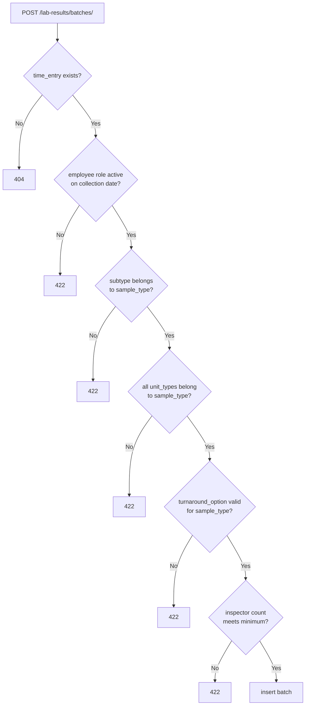

## Purpose

Owns lab result data: sample batch records and their associated units, inspectors, and turnaround options. Structured as two distinct layers — a config layer (admin-managed type definitions) and a data layer (field-collected batch records).

This module does **not** own time entries (though batches reference them), project state, or WA code logic. It owns the act of recording what samples were collected, by whom, in what quantity, and under which type classification.

---

## Non-obvious behavior

**Config layer vs. data layer — adding a new sample type requires no migration.**

| Layer | Tables | Who manages |
|-------|--------|-------------|
| Config | `sample_types`, `sample_subtypes`, `sample_unit_types`, `turnaround_options`, `sample_type_required_roles`, `sample_type_wa_codes` | Admin via `/lab-results/config/` endpoints |
| Data | `sample_batches`, `sample_batch_units`, `sample_batch_inspectors` | Field staff / managers via `/lab-results/batches/` endpoints |

A new sample type (e.g., a new asbestos protocol) is added as admin rows in the config layer — no schema migration needed. This is intentional.

**`sample_unit_type.sample_type_id` must match `batch.sample_type_id`.** The service validates this before inserting a batch unit. Mismatch returns 422. This is **not** enforced at the DB level; it's application-layer only.

**Batch creation validation chain:**

**`quick-add` path (Phase 3.6) bypasses the `time_entry_id` requirement.** `POST /lab-results/batches/quick-add` accepts `employee_id`, `project_id`, `school_id`, and `date_collected` instead of a `time_entry_id`. It calls `resolve_or_create_time_entry()` which either finds an existing entry for that employee/project/school/date or creates a placeholder (`status=assumed`, `created_by_id=SYSTEM_USER_ID`). This path is not yet implemented.

**`sample_type_wa_codes`** records which WA codes are required to bill a given sample type. When a batch is recorded, the service should check for WA codes not yet on the project's WA and surface them as a project flag (Phase 4 gap — not yet wired). The table and FK are in place.

**`SampleBatch.status`** (`active` / `discarded` / `locked`) is planned but not yet fully implemented. Do not implement status transitions until the state model is finalized. Locked batches are read-only once `lock_project_records()` runs in Phase 6.

---

## Before you modify

- **Config tables are admin-managed** — do not hard-code sample type IDs or subtype IDs in service logic. Always look them up by name or code.
- **`sample_unit_type` → `sample_type` validation** is service-layer only. If you add a new batch creation path, this check must be included explicitly.
- **Router is split** into `router/config.py` (admin CRUD for type definitions) and `router/batches.py` (data entry). Keep them separate — do not mix config and data endpoints in the same router file.
- **Tests**: batch creation tests require a valid `time_entry` with an active employee role on the collection date, plus a complete config fixture (sample type, subtype, unit type, turnaround option). Build a shared fixture rather than duplicating setup across test cases.
