## Purpose

Owns `TimeEntry` records — the log of when a specific employee worked on a specific project at a specific school, in a specific certified role.

This module does **not** own employee role definitions (that's `employees/`), project-school link validation (that's `projects/`), or conflict resolution notes (that's the forthcoming `notes/` module). It owns the time record itself and the service logic that validates it on insert.

---

## Non-obvious behavior

**State model (`status` column — implemented Phase 4):**

```mermaid
stateDiagram-v2
    [*] --> assumed : system creates placeholder\n(quick-add path, times not yet confirmed)
    [*] --> entered : manager enters directly\n(times confirmed at insert)
    assumed --> entered : manager edits any field\n(updated_by_id = manager; created_by_id stays SYSTEM_USER_ID)
    entered --> locked : project closes\n(lock_project_records called — Phase 6)
    assumed --> locked : project closes\n(lock_project_records called — Phase 6)
    locked --> locked : read-only; no further transitions
```

**Overlap detection returns 422 — it does not create system notes.** When two time entries for the same employee would overlap, the second insert (or the PATCH that would create the overlap) returns 422 identifying the conflicting entry. The overlap check is cross-project: an employee cannot have two overlapping entries regardless of which projects they belong to.

**NULL `end_datetime` is valid only on `assumed` entries.** These are always created with `start_datetime` at midnight (`00:00:00`) of the work date. For overlap purposes, a NULL end is treated as midnight of the next day (`start + 1 day`), which is correct because start is always at midnight.

**`created_by_id == SYSTEM_USER_ID` is the only way to identify system-created entries.** There is no `source` column — it was dropped as redundant. A `created_by_id` of `1` means the entry was created by the quick-add path; any other value means a manager entered it directly.

**`employee_role_id` is a FK to a specific `EmployeeRole` instance**, not a role type. The service validates that the referenced role was active on `start_datetime.date()`. If a manager backdates an entry and the employee's role wasn't active on that date, the insert is rejected with 422.

**Composite FK to `project_school_links`.** Both `project_id` and `school_id` are stored on the entry, and together they must exist as a row in `project_school_links`. The school must already be linked to the project before a time entry for that school can be created.

---

## Before you modify

- **Do not add a `conflicted` status value.** Explicitly dropped. Overlap returns 422 at entry time.
- **Do not add a `source` column.** Dropped as redundant — use `created_by_id == SYSTEM_USER_ID` instead.
- **Locked entries are read-only.** Once Phase 6 implements `lock_project_records()`, update endpoints must check `status != locked` before allowing changes.
- **Deleting a time entry** that has `active` or `discarded` sample batches is blocked with 409. Managers must reassign or delete those batches first.
- **Tests**: `.venv/Scripts/python.exe -m pytest app/time_entries/ -v`; the rollback fixture pattern means never call `db.commit()` inside test bodies.
