## Purpose

Owns `TimeEntry` records — the log of when a specific employee worked on a specific project at a specific school, in a specific certified role.

This module does **not** own employee role definitions (that's `employees/`), project-school link validation (that's `projects/`), or conflict resolution notes (that's the forthcoming `notes/` module). It owns the time record itself and the service logic that validates it on insert.

---

## Non-obvious behavior

**`status` column is planned but not yet implemented (Phase 3.6).** The state model below describes the intended behavior once that column is added. Do not implement status transitions or blocking logic before Phase 3.6.

**Planned state model:**

```mermaid
stateDiagram-v2
    [*] --> assumed : system creates placeholder\n(quick-add path, times not yet confirmed)
    [*] --> entered : manager enters directly\n(times confirmed at insert)
    assumed --> entered : manager confirms times from daily logs
    entered --> locked : project closes\n(lock_project_records called)
    assumed --> locked : project closes\n(lock_project_records called)
    locked --> locked : read-only; no further transitions
```

**Overlap detection creates system notes — it does not 422.** When two time entries for the same employee overlap, the service creates a `time_entry_conflict` system note (Phase 3.6) on **both** conflicting entries with `is_blocking=True`. Neither entry is rejected. This is intentional: blocking the second manager's insert creates a race to enter first; allowing both with blocking notes lets both projects record real work while surfacing the conflict for resolution. Neither project can close until the notes are resolved.

**`created_by_id == SYSTEM_USER_ID` is the only way to identify system-created entries.** There is no `source` column — it was dropped as redundant. A `created_by_id` of `1` means the entry was created by the quick-add path; any other value means a manager entered it directly.

**`employee_role_id` is a FK to a specific `EmployeeRole` instance**, not a role type. The service validates that the referenced role was active on `start_datetime.date()`. If a manager backdates an entry and the employee's role wasn't active on that date, the insert is rejected with 422.

**Composite FK to `project_school_links`.** Both `project_id` and `school_id` are stored on the entry, and together they must exist as a row in `project_school_links`. The school must already be linked to the project before a time entry for that school can be created.

**`end_datetime` is nullable.** Entries can be created without an end time (e.g., system placeholders). The service allows this; billing calculations must handle the null case.

---

## Before you modify

- **Do not add a `conflicted` status value.** This was explicitly dropped. Overlap is handled via blocking notes (Phase 3.6), not a status column.
- **Do not add a `source` column.** Dropped as redundant — use `created_by_id == SYSTEM_USER_ID` instead.
- **Locked entries are read-only.** Once Phase 6 implements `lock_project_records()`, update endpoints must check `status != locked` before allowing changes.
- **Deleting a time entry** that has `active` or `discarded` sample batches is blocked with 409. Managers must reassign or delete those batches first.
- **Tests**: `pytest tests/ -v -k time_entries`; the rollback fixture pattern means never call `db.commit()` inside test bodies.
