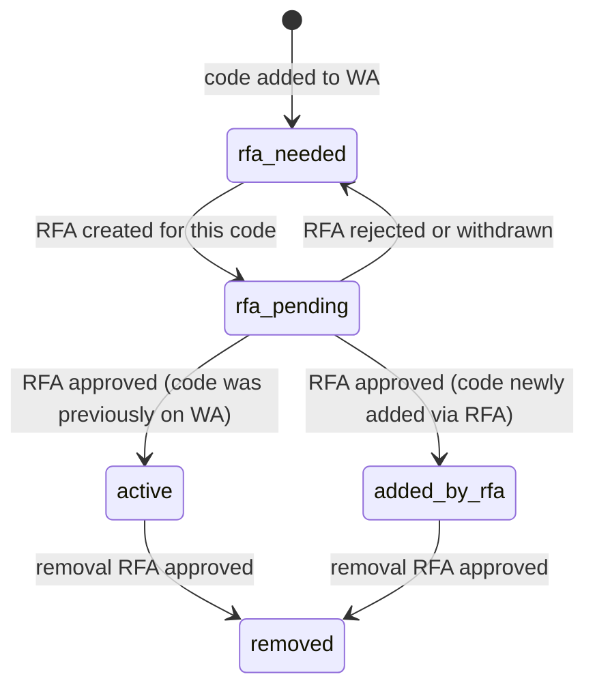
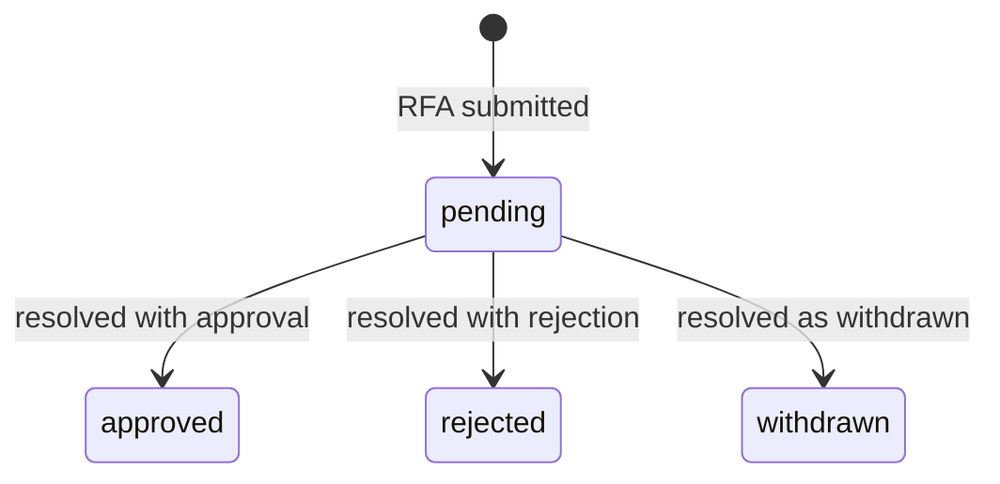

## Purpose

Owns work authorization records (`WorkAuth`), WA code assignments (`WorkAuthProjectCode`, `WorkAuthBuildingCode`), and the RFA workflow (`RFA`, `RFAProjectCode`, `RFABuildingCode`).

This module does **not** own WA code definitions (that's `wa_codes/`) or project state. A `WorkAuth` is the contractual instrument that authorizes specific scopes of work; the codes assigned to it define which work is authorized and at what cost.

---

## Non-obvious behavior

**One `WorkAuth` per project, enforced by a unique FK.** `work_auths.project_id` has a `UNIQUE` constraint. Attempting to create a second WA for the same project returns 409.

**WA code default status is `rfa_needed`, not `active`.** When a code is first added to a WA via `POST /work-auths/{id}/project-codes` or `POST /work-auths/{id}/building-codes`, it lands with `status = rfa_needed`. An approved RFA is required to activate it. This means a WA can exist with codes on it before any work is actually authorized.

**WA code status state machine:**

**RFA state machine:**

**One pending RFA per WA at a time.** Enforced at the application layer. Attempting to create a second RFA for a WA that already has a `pending` RFA returns 409.

**WA code mutations automatically maintain deliverable state (Phase 6 Session B).** Every endpoint that adds, removes, or changes a WA code — `POST /work-auths/`, `POST/DELETE /work-auths/{id}/project-codes`, `POST/DELETE /work-auths/{id}/building-codes`, `PATCH /work-auths/{id}/rfas/{rfa_id}` — calls `ensure_deliverables_exist(project_id)` followed by `recalculate_deliverable_sca_status(project_id)` before the final commit. The call order matters: `ensure` creates any missing deliverable rows first; `recalculate` then sets their status correctly in the same transaction.

**RFA resolution has side effects on code statuses:**
- **Approved**: applies `budget_adjustment` to `work_auth_building_codes.budget` for each `RFABuildingCode` in the RFA; transitions affected code statuses to `active` or `added_by_rfa`.
- **Rejected or withdrawn**: reverts all affected code statuses back to `rfa_needed`.

**`RFABuildingCode.budget_adjustment` is nullable.** A removal action on a building code may or may not include a budget adjustment; nullable is intentional.

**`RFAProjectCode` and `RFABuildingCode` use the same composite FK to `project_school_links`** as `WorkAuthBuildingCode`. The `(project_id, school_id)` pair must exist in `project_school_links` before either can be inserted.

---

## Before you modify

- **WA code deliverable wiring is already in place** (Phase 6 Session B). Do not add another `recalculate_deliverable_sca_status` or `ensure_deliverables_exist` call — they are already called in every code-mutation endpoint before commit.
- **`is_saved`** on `WorkAuth` is a manual flag (WA file saved on the office server) — it has no automated logic and is toggled by users only.
- **Do not add a second pending RFA** check at the model layer — keep it in the service where it can return a clean 409 with explanation.
- **Tests**: RFA resolution tests must verify both the code status transitions and the budget adjustments in a single transaction; do not split them across separate test cases.
