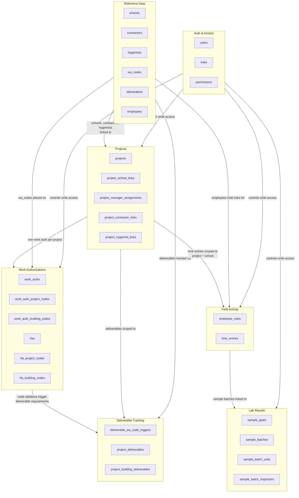

# Database Schema — Domain Overview

High-level map of the six domains and how data flows between them. See the numbered files in this directory for ER diagrams with full column details.

---

---

## Domain Summaries

| Domain | Purpose | Key Tables |
|--------|---------|------------|
| **Auth** | User authentication and role-based permissions | `users`, `roles`, `permissions` |
| **Reference Data** | Seed/config entities that don't change often | `schools`, `wa_codes`, `employees`, `deliverables` |
| **Projects** | Core project record with linked people and buildings | `projects`, `project_school_links` |
| **Work Authorizations** | WA issuance, code tracking, and RFA approval flow | `work_auths`, `rfas` |
| **Deliverable Tracking** | Two-status lifecycle per deliverable per project/school | `project_deliverables`, `project_building_deliverables` |
| **Field Activity** | Time entries recording employee work on a project + school | `employee_roles`, `time_entries` |
| **Lab Results** | Sample batches collected in the field, linked to time entries | `sample_types`, `sample_batches` |
