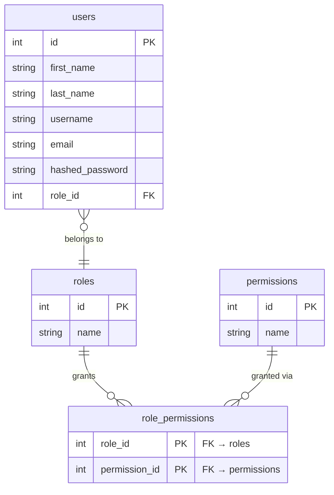

# Schema — Auth & Access

Authentication, roles, and permission enforcement.

## Notes

- `permission.name` stores the action string (e.g., `project:edit`, `user:create`). The full list is defined in `app/common/enums.py` as `PermissionName`.
- `roles` are named (`superadmin`, `admin`, `coordinator`, `inspector`). Each role has a fixed permission set seeded by `app/scripts/db.py`.
- `users` carries `AuditMixin` columns (`created_at`, `updated_at`, `created_by_id`, `updated_by_id`) — omitted above for clarity.
- The **system user** (`username="system"`, `id=1`) is a reserved seed row used by automated writes (quick-add time entries, status recalculations). It cannot log in.
