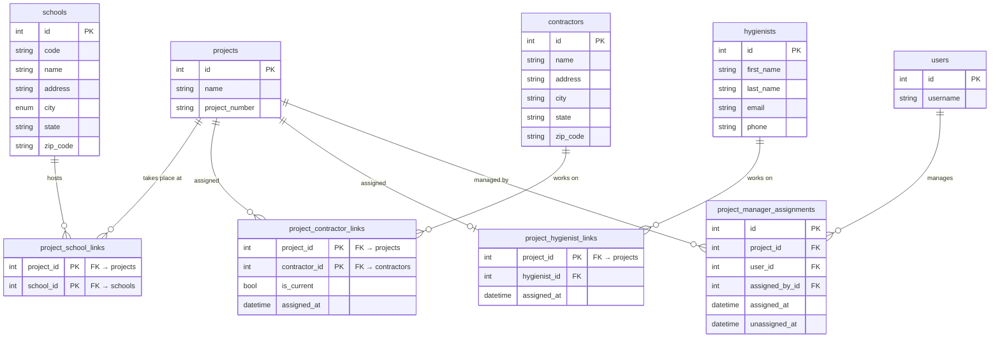

# Schema — Projects

The core project record and all entities linked to it: buildings (schools), contractors, hygienists, and manager assignment history.

## Notes

- `project_school_links` is also used as a **composite FK target** by `work_auth_building_codes`, `rfa_building_codes`, `project_building_deliverables`, and `time_entries`. Any row in those tables is guaranteed to reference a `(project_id, school_id)` pair that exists here.
- `project_contractor_links.is_current` flags the active contractor. A project can have historical contractor entries; only one should have `is_current = true` at a time.
- `project_hygienist_links` is effectively one-to-one (project_id is the PK), modelled as a link table so assignment history can be added later without a schema change.
- `project_manager_assignments` is an **append-only audit trail**. The active manager is the row where `unassigned_at IS NULL`. Reassignment closes the current row and inserts a new one — rows are never updated in-place.
- `projects` and `schools` carry `AuditMixin` columns — omitted above for clarity.
