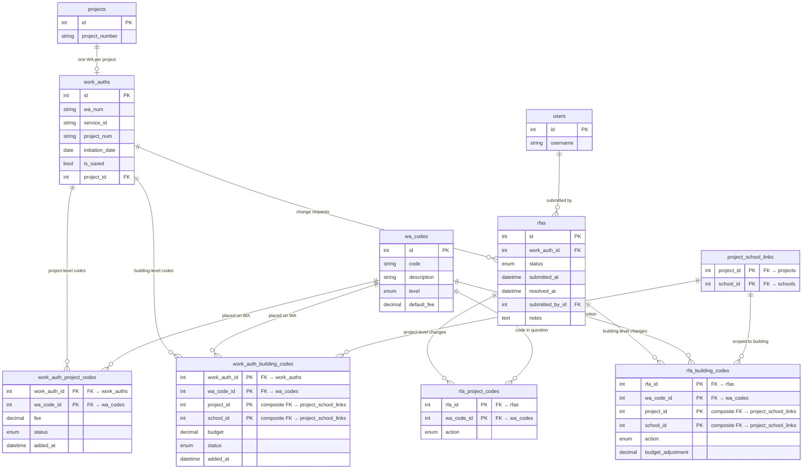

# Schema — Work Authorizations

Work auth issuance, WA code placement, and the RFA approval workflow for adding/removing codes after issuance.

## Notes

**WA code status enum** (`wa_code_status`):
| Value | Meaning |
|-------|---------|
| `rfa_needed` | Code required but no active RFA covers it |
| `rfa_pending` | Code is in a currently submitted RFA |
| `active` | On the WA at issuance — no RFA involved |
| `added_by_rfa` | Added via an approved RFA |
| `removed` | Was on the WA, now removed |

**RFA status enum** (`rfa_status`): `pending` → `approved` / `rejected` / `withdrawn`

**RFA action enum** (`rfa_action`): `add` or `remove`

**Project vs building split:**
- `wa_codes.level = "project"` → goes in `work_auth_project_codes`
- `wa_codes.level = "building"` → goes in `work_auth_building_codes` (scoped to a specific school on the project)
- The app layer enforces this; inserting a building-level code into the project table returns 422.

**RFA resolve logic:**
- `approved` → sets matching `work_auth_*_codes.status` to `added_by_rfa` or `removed`; applies `budget_adjustment` to `work_auth_building_codes.budget`
- `rejected` / `withdrawn` → reverts affected codes to `rfa_needed`

**One pending RFA per work auth** is enforced at the application layer.

- `work_auths` and `rfas` carry `AuditMixin` columns — omitted above for clarity.
