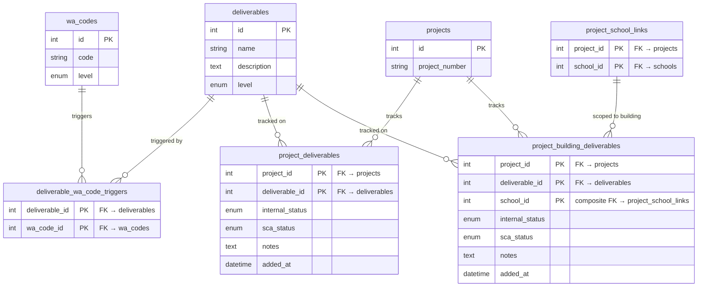

# Schema — Deliverable Tracking

Deliverable definitions, their WA code triggers, and per-project/per-building status tracking.

## Notes

**`deliverables.level`** controls which table rows land in:
- `project` → one `project_deliverables` row per project
- `building` → one `project_building_deliverables` row per linked school on the project

**`deliverable_wa_code_triggers`** is static config (seeded, rarely changed). It defines which WA codes, when added to a work auth, should cause `ensure_deliverables_exist()` to create the corresponding deliverable row if it doesn't already exist. This is implemented in Phase 5.

**Two-status tracking** — each row carries two independent statuses:

`internal_status` (tracks internal preparation):
| Value | Meaning |
|-------|---------|
| `incomplete` | Not started |
| `blocked` | Blocked — `notes` must explain why |
| `in_review` | Internal review in progress |
| `in_revision` | Returned for revision |
| `completed` | Internally complete |

`sca_status` (tracks SCA-facing submission lifecycle):
| Value | Derivable? | Meaning |
|-------|-----------|---------|
| `pending_wa` | ✓ auto | No work auth exists yet |
| `pending_rfa` | ✓ auto | WA exists but required code is pending RFA |
| `outstanding` | ✓ auto | Code is active; deliverable not yet submitted |
| `under_review` | manual | Submitted to SCA |
| `rejected` | manual | Rejected by SCA |
| `approved` | manual | Approved by SCA |

The first three `sca_status` values are maintained by `recalculate_deliverable_sca_status(project_id)` (Phase 5). The last three are set manually.
