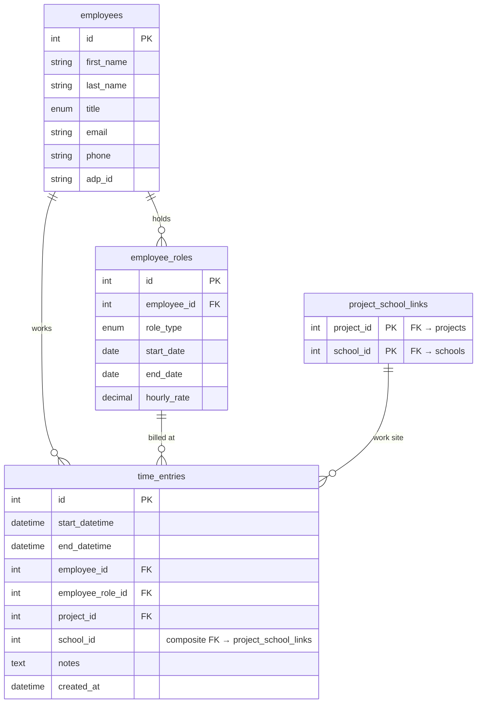

# Schema — Field Activity

Employee roles (time-bound rate records) and time entries recording work on a specific project + building.

## Notes

**`employee_roles`** is a time-bound record: one row per role type per period. An employee can hold multiple roles (e.g., Air Tech from Jan–Jun, then Project Monitor from Jul onward). `end_date = NULL` means the role is currently active.

The application enforces **no overlapping roles of the same type** for the same employee. This is validated at the app layer; for PostgreSQL a `EXCLUDE USING gist` constraint is planned (see Hazard 2 in roadmap).

**`time_entries`** validation at insert:
1. `employee_role_id` must belong to `employee_id`
2. `employee_role` must have been active on `start_datetime.date()`
3. `(project_id, school_id)` must exist in `project_school_links`

**`end_datetime` is nullable** — a manager can create an entry with only `start_datetime` and fill in the end time later from the daily activity log.

**Time entry state model** (Phase 4 — migration pending):

`source` column (immutable):
| Value | Meaning |
|-------|---------|
| `manual` | Entered by a manager from activity logs |
| `system` | Auto-created by the quick-add endpoint |

`status` column (mutable):
| Value | Meaning |
|-------|---------|
| `assumed` | System placeholder; times are implied (00:00–00:00 next day), not confirmed |
| `entered` | Manually input or manager-confirmed |
| `conflicted` | Overlaps another entry for the same employee; blocks project closure |
| `locked` | Project closed; read-only |

When a manager edits a `source=system` entry: `source → manual`, `status → entered`. `created_by_id` stays as the system user (immutable origin); `updated_by_id` = manager's ID.

- `time_entries` will carry `AuditMixin` columns after Phase 3.5 is complete.
