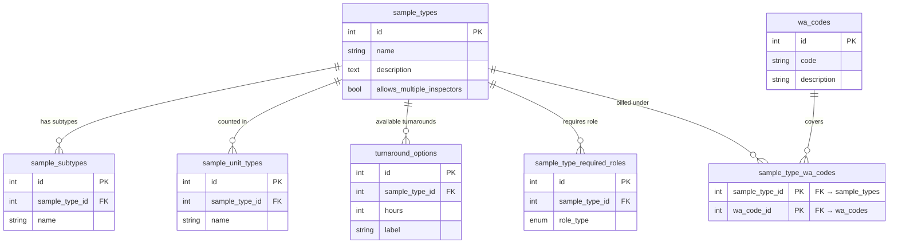
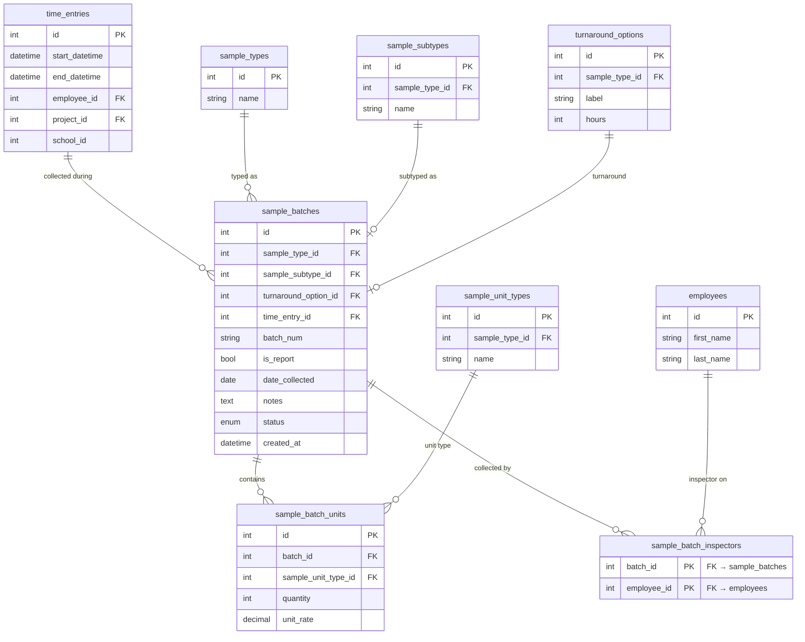

# Schema — Lab Results

Two-layer design: admin-configurable sample type definitions (config layer) and per-job recorded batches (data layer). Adding a new sample type requires no code or migration — an admin adds rows to the config tables.

---

## Config Layer

---

## Data Layer

---

## Notes

**`sample_batches.is_report`** — distinguishes two documents:
- `false` (default): the handwritten COC received from the field
- `true`: the printed lab report document (table of results) received from the lab; required for project closure

**`sample_batches.status`** (Phase 4 — migration pending):
| Value | Meaning |
|-------|---------|
| `active` | Normal state |
| `orphaned` | `time_entry_id` was deleted or revised past `date_collected`; `time_entry_id` becomes NULL; blocks project closure until re-linked or discarded |
| `discarded` | Explicitly invalidated by a manager |
| `locked` | Project closed; read-only |

**`sample_batch_units.unit_rate`** is nullable — it will be populated from a future `sample_rates` config table (billing follow-up project). Until then, quantities are tracked without a rate value.

**Unit type scoping** — `sample_batch_units.sample_unit_type_id` must belong to the batch's `sample_type_id`. The app layer validates this on insert (422 otherwise).

**`sample_type_required_roles`** — which `EmployeeRoleType` values an employee must hold to collect this sample. If a sample type has no required roles, any employee with an active role on `date_collected` is accepted.

**Quick-add endpoint** (`POST /lab-results/batches/quick-add`, Phase 4 remaining): accepts `project_id`, `school_id`, `employee_id`, `date_collected` instead of `time_entry_id`. Creates a system placeholder time entry if none exists for that employee/project/school/date.
